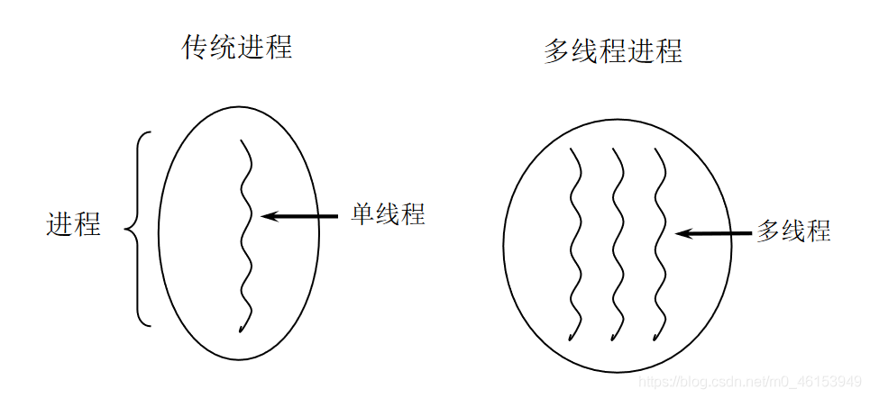
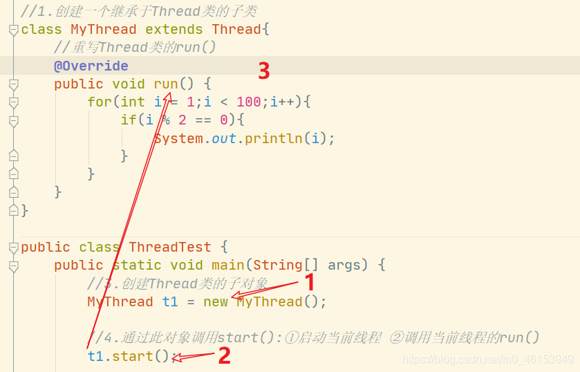
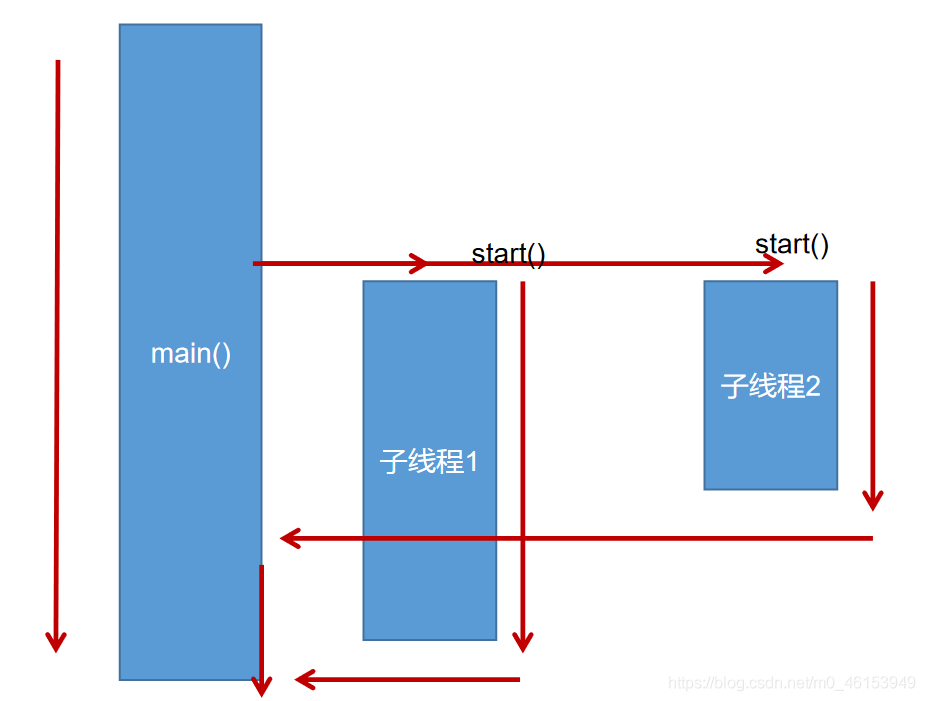
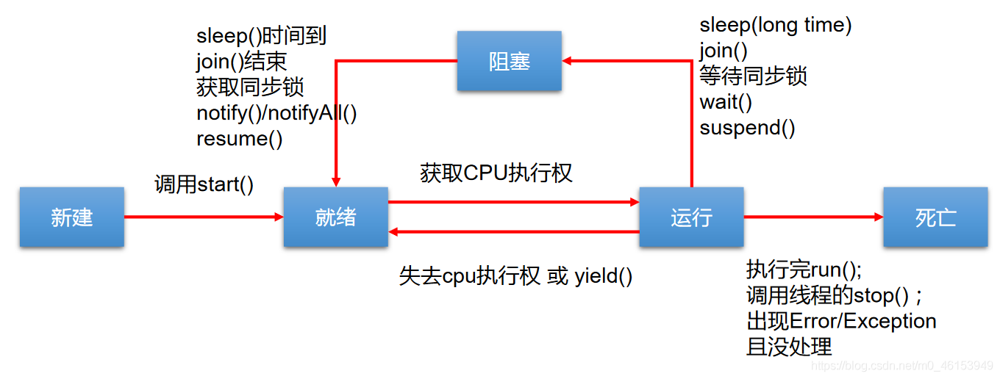

# 多线程

## 1. 基本概念：程序、进程、线程

### 1.1 定义

- **程序(program)**：**为完成特定任务、用某种语言编写的一组指令的集合**。即指一段静态的代码，静态对象。

- **进程(process)**：程序的一次执行过程，或是**正在运行的一个程序**。是一个动态的过程：有它自身的产生、存在和消亡的过程。——生命周期

  - 如：运行中的QQ，运行中的MP3播放器程序是静态的，进程是动态的
  - 进程作为资源分配的单位，系统在运行时会为每个进程分配不同的内存区域

- 线程(thread)，进程可进一步细化为线程，是一个程序内部的一条执行路径。

  - 若一个进程同一时间并行执行多个线程，就是支持多线程的
  - 线程是调度和执行的单位，每个线程拥有独立的运行栈和程序计数器(pc)，线程切换的开销小
  - 一个进程中的多个线程共享相同的内存单元/内存地址空间—》它们从同一堆中分配对象，可以访问相同的变量和对象。这就使得线程间通信更简便、高效。但多个线程操作共享的系统资源可能就会带来安全的隐患。

  

### 1.2 进程与线程



- 单核CPU和多核CPU的理解
  - 单核CPU，其实是一种假的多线程，因为在一个时间单元内，也只能执行一个线程的任务。例如：虽然有多车道，但是收费站只有一个工作人员在收费，只有收了费才能通过，那么CPU就好比收费人员。如果有某个人不想交钱，那么收费人员可以把他“挂起”（晾着他，等他想通了，准备好了钱，再去收费）。但是因为CPU时间单元特别短，因此感觉不出来。
  - 如果是多核的话，才能更好的发挥多线程的效率。（现在的服务器都是多核的）
  - 一个Java应用程序java.exe，其实至少有三个线程：main()主线程，gc()垃圾回收线程，异常处理线程。当然如果发生异常，会影响主线程。
- 并行与并发
  - 并行：多个CPU同时执行多个任务。比如：多个人同时做不同的事。
  - 并发：一个CPU(采用时间片)同时执行多个任务。比如：秒杀、多个人做同一件事。

### 1.3 使用多线程的优点

- 背景

  > 以单核CPU为例，只使用单个线程先后完成多个任务（调用多个方法），肯定比用多个线程来完成用的时间更短，为何仍需多线程呢？

- 优点

  - 提高应用程序的响应。对图形化界面更有意义，可增强用户体验。
  - 提高计算机系统CPU的利用率
  - 改善程序结构。将既长又复杂的进程分为多个线程，独立运行，利于理解和修改

### 1.4 何时需要多线程

- 程序需要同时执行两个或多个任务。
- 程序需要实现一些需要等待的任务时，如用户输入、文件读写操作、网络操作、搜索等。
- 需要一些后台运行的程序时。

## 2. 线程的创建和使用

### 2.1 线程的分类

> Java中的线程分为两类：一种是守护线程，一种是用户线程。

- 它们在几乎每个方面都是相同的，唯一的区别是判断JVM何时离开。
- 守护线程是用来服务用户线程的，通过在start()方法前调用**thread.setDaemon(true)**
- 可以把一个用户线程变成一个守护线程。
- Java垃圾回收就是一个典型的守护线程。
- 若JVM中都是守护线程，当前JVM将退出。
- 形象理解：兔死狗烹，鸟尽弓藏

### 2.2 线程的创建和启动

- Java语言的JVM允许程序运行多个线程，它通过`java.lang.Thread`类来体现。
- `Thread`类的特性
  - 每个线程都是通过某个特定`Thread`对象的`run()`方法来完成操作的，经常把`run()`方法的主体称为线程体
  - 通过该`Thread`对象的`start()方`法来启动这个线程，而非直接调用`run()`

### 2.3 线程的调度

- 调度策略
  - 时间片
  
  - **抢占式：高优先级的线程抢占CPU**
- Java的调度方法
  - 同优先级线程组成先进先出队列（先到先服务），使用时间片策略
  - 对高优先级，使用优先调度的抢占式策略

### 2.4 Thread类构造函数

- Thread()：创建新的Thread对象
- Thread(String threadname)：创建线程并指定线程实例名
- Thread(Runnabletarget)：指定创建线程的目标对象，它实现了Runnable接口中的run方法
- Thread(Runnable target, String name)：创建新的Thread对象

### 2.5 API中创建线程的两种方式

- 继承thread类

  ```java
  /**
   * 多线程的创建，方式一：继承于Thread类
   * 1.创建一个继承于Thread类的子类
   * 2.重写Thread的run()方法 ---> 将此线程的方法声明在run()中
   * 3.创建Thread类的子对象
   * 4.通过此对象调用start()
   *
   * 例子:遍历100以内的所有的偶数
   */

  //1.创建一个继承于Thread类的子类
  class MyThread extends Thread{
      //重写Thread类的run()
      @Override
      public void run() {
          for(int i = 1;i < 100;i++){
              if(i % 2 == 0){
                  System.out.println(i);
              }
          }
      }
  }

  public class ThreadTest {
      public static void main(String[] args) {
          //3.创建Thread类的子对象
          MyThread t1 = new MyThread();

          //4.通过此对象调用start():①启动当前线程 ②调用当前线程的run()
          t1.start();

          //如下操作仍在main线程中执行的
          for(int i = 1;i < 100;i++){
              if(i % 2 == 0){
                  System.out.println(i + "***main()***");
              }
          }
      }
  }
  ```

  - 子线程的创建和启动过程

  

  

  - 问题说明

    ```java
    //1.创建一个继承于Thread类的子类
    class MyThread extends Thread{
        //重写Thread类的run()
        @Override
        public void run() {
            for(int i = 1;i < 100;i++){
                if(i % 2 == 0){
                    System.out.println(Thread.currentThread().getName() + ":" + i);
                }
            }
        }
    }

    public class ThreadTest {
        public static void main(String[] args) {
            //3.创建Thread类的子对象
            MyThread t1 = new MyThread();

            //4.通过此对象调用start():①启动当前线程 ②调用当前线程的run()
            t1.start();
            //问题1:我们不能通过直接调用run()的方式启动线程。
    		// t1.run();

            //问题二:再启动一个线程，遍历100以内的偶数。不可以还让已经start()的线程去执行。会报IllegalThreadStateException
            // t1.start();
            //我们需要重现创建一个线程的对象，去start().
            MyThread t2 = new MyThread();
            t2.start();

            //如下操作仍在main线程中执行的
            for(int i = 1;i < 100;i++){
                if(i % 2 == 0){
                    System.out.println(Thread.currentThread().getName() + ":" + i + "***main()***");
                }
            }
        }
    }
    ```

  - 练习

    - 练习1

      ```java
      /**
       * 练习:创建两个分线程，其中一个遍历100以内的偶数，另一个遍历100以内的奇数
       */
      public class ThreadDemo {
          public static void main(String[] args) {
              MyThread m1 = new MyThread();
              m1.start();

              MyThread2 m2 = new MyThread2();
              m2.start();
          }
      }
      class MyThread extends Thread{
          @Override
          public void run() {
              for(int i = 0;i < 100;i++){
                  if(i % 2 == 0){
                      System.out.println(Thread.currentThread().getName() + ":" + i);
                  }
              }
          }
      }
      class MyThread2 extends Thread{
          @Override
          public void run() {
              for(int i = 0;i < 100;i++){
                  if(i % 2 != 0){
                      System.out.println(Thread.currentThread().getName() + ":" + i);
                  }
              }
          }
      }
      ```

    - 练习2

      ```java
      /**
       * 练习:创建两个分线程，其中一个遍历100以内的偶数，另一个遍历100以内的奇数
       */
      public class ThreadDemo {
          public static void main(String[] args) {

              //创建Thread类的匿名子类的方式
              new Thread(){
                  @Override
                  public void run() {
                      for(int i = 0;i < 100;i++){
                          if(i % 2 == 0){
                              System.out.println(Thread.currentThread().getName() + ":" + i);
                          }
                      }
                  }
              }.start();

              new Thread(){
                  @Override
                  public void run() {
                      for(int i = 0;i < 100;i++){
                          if(i % 2 != 0){
                              System.out.println(Thread.currentThread().getName() + ":" + i);
                          }
                      }
                  }
              }.start();
          }
      }
      ```

    - 练习3

      ```java
      /**
       * 例子：创建三个c窗口卖票，总票数为100张
       *
       * 存在线程的安全问题，待解决。
       */
      class Windows extends Thread{

          private static int ticket = 100;

          @Override
          public void run() {
              while(true){
                  if(ticket > 0){
                      System.out.println(getName() + ":卖票，票号为: " + ticket);
                      ticket--;
                  }else{
                      break;
                  }
              }
          }
      }

      public class WindowsTest {
          public static void main(String[] args) {
              Windows t1 = new Windows();
              Windows t2 = new Windows();
              Windows t3 = new Windows();

              t1.setName("窗口1");
              t2.setName("窗口2");
              t3.setName("窗口3");

              t1.start();
              t2.start();
              t3.start();
          }
      }
      ```


- 实现Runnable接口

  ```java
  /**
   * 创建多线程的方式二：实现Runnable接口
   * 1.创建一个实现了Runnable接口得类
   * 2.实现类去实现Runnable中的抽象方法:run()
   * 3.创建实现类的对象
   * 4.将此对象作为参数传递到Thread类的构造器中，创建Thread类的对象
   * 5.通过Thread类的对象调用start()
   */
  //1.创建一个实现了Runnable接口得类
  class MThread implements Runnable{

      //2.实现类去实现Runnable中的抽象方法:run()
      @Override
      public void run() {
          for(int i = 0;i < 100;i++){
              if(i % 2 == 0){
                  System.out.println(Thread.currentThread().getName() + ":" + i);
              }
          }
      }
  }

  public class ThreadTest1 {
      public static void main(String[] args) {
          //3.创建实现类的对象
          MThread m1 = new MThread();
          //4.将此对象作为参数传递到Thread类的构造器中，创建Thread类的对象
          Thread t1 = new Thread(m1);
          //5.通过Thread类的对象调用start():①启动线程 ②调用当前线程的run() --> 调用了Runnable类型的target的run()
          t1.start();

          //再启动一个线程，遍历100以内的偶数
          Thread t2 = new Thread(m1);
          t2.setName("线程2");
          t2.start();
      }
  }
  ```

- 继承方式和实现方式的联系与区别

  - 开发中优先选择：实现Runnable接口的方式
  - 原因：
    - 实现的方式没有类的单继承性的局限性
    - 实现的方式更适合来处理多个线程有共享数据的情况。
  - 联系：public class Thread implements Runnable
  - 相同点：两种方式都需要重写run(),将线程要执行的逻辑声明在run()中。

### 2.6 Thread类的有关方法

```java
/**
 * 测试Thread类的常用方法
 * 1.start():启动当前线程，执行当前线程的run()
 * 2.run():通常需要重写Thread类中的此方法，将创建的线程要执行的操作声明在此方法中
 * 3.currentThread(): 静态方法，返回当前代码执行的线程
 * 4.getName():获取当前线程的名字
 * 5.setName():设置当前线程的名字
 * 6.yield():释放当前CPU的执行权
 * 7.join():在线程a中调用线程b的join(),此时线程a就进入阻塞状态，直到线程b完全执行完以后，线程a才
 *          结束阻塞状态。
 * 8.stop():已过时。当执行此方法时，强制结束当前线程。
 * 9.sleep(long millitime)：让当前线程“睡眠”指定时间的millitime毫秒)。在指定的millitime毫秒时间内，
 *                          当前线程是阻塞状态的。
 * 10.isAlive()：返回boolean，判断线程是否还活着
 */

class HelloThread extends Thread{
    @Override
    public void run() {
        for(int i = 0;i < 100; i++){

            try {
                sleep(10);
            } catch (InterruptedException e) {
                e.printStackTrace();
            }

            if(i % 2 == 0){
                System.out.println(Thread.currentThread().getName() + ":" + i);
            }
			//if(i % 20 == 0){
				//yield();
			//}
        }
    }

    public HelloThread(String name){
        super(name);
    }
}

public class ThreadModeTest {
    public static void main(String[] args) {
        HelloThread h1 = new HelloThread("Thread : 1");

		//h1.setName("线程一");

        h1.start();

        //给主线程命名
        Thread.currentThread().setName("主线程");

        for(int i = 0;i < 100; i++){
            if(i % 2 == 0){
                System.out.println(Thread.currentThread().getName() + ":" + i);
            }

            if(i == 20){
                try {
                    h1.join();
                } catch (InterruptedException e) {
                    e.printStackTrace();
                }
            }
        }

        System.out.println(h1.isAlive());
    }
}
```


### 2.7 线程的优先级

```java
/**
 * - 线程的优先级等级
 *   - MAX_PRIORITY：10
 *   - MIN _PRIORITY：1
 *   - NORM_PRIORITY：5 --->默认优先级
 * - 涉及的方法
 *   - getPriority() ：返回线程优先值
 *   - setPriority(intnewPriority) ：改变线程的优先级
 *
 *   说明:高优先级的线程要抢占低优先级线程cpu的执行权。
 *       但是只是从概率上讲，高优先级的线程高概率的情况下被执行。
 *       并不意味着只有当高优先级的线程执行完以后，低优先级的线程才会被执行。
 */

class HelloThread extends Thread {
    @Override
    public void run() {
        for (int j = 0; j < 100; j++) {

			//try {
				//sleep(10);
			//} catch (InterruptedException e) {
				//e.printStackTrace();
			//}

            if (j % 2 == 0) {
                System.out.println(getName() + ":" + getPriority() + ":" + j);
            }
        }
    }
    public HelloThread(String name){
        super(name);
    }
}

public class ThreadModeTest {
    public static void main(String[] args) {
        HelloThread h2 = new HelloThread("Thread : 1");
        h2.start();

        //设置分线程的优先级
        h2.setPriority(Thread.MAX_PRIORITY);

        //给主线程命名
        Thread.currentThread().setName("主线程");
        Thread.currentThread().setPriority((Thread.MIN_PRIORITY));

        for(int j = 0;j < 100; j++){
            if(j % 2 == 0){
                System.out.println(Thread.currentThread().getName() + ":" + Thread.currentThread().getPriority() + ":" + j);
            }

			//if(j == 20){
				//try {
					//h2.join();
				//} catch (InterruptedException e) {
					//e.printStackTrace();
				//}
			//}
        }

        System.out.println(h2.isAlive());
    }
}
```

## 3. 线程的生命周期

- JDK中用Thread.State类定义了线程的几种状态

  - 新建：当一个Thread类或其子类的对象被声明并创建时，新生的线程对象处于新建状态
  - 就绪：处于新建状态的线程被start()后，将进入线程队列等待CPU时间片，此时它已具备了运行的条件，只是没分配到CPU资源
  - 运行：当就绪的线程被调度并获得CPU资源时,便进入运行状态，run()方法定义了线程的操作和功能
  - 阻塞：在某种特殊情况下，被人为挂起或执行输入输出操作时，让出CPU并临时中止自己的执行，进入阻塞状态
  - 死亡：线程完成了它的全部工作或线程被提前强制性地中止或出现异常导致结束

- 线程的生命周期
  


